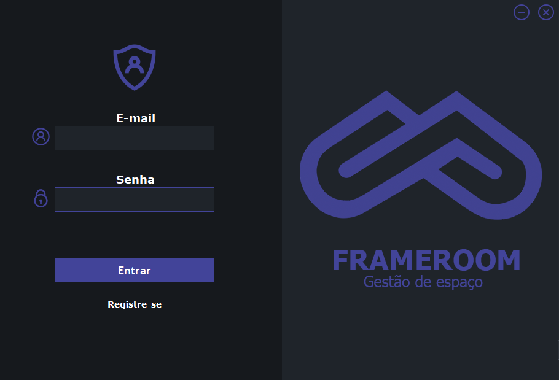
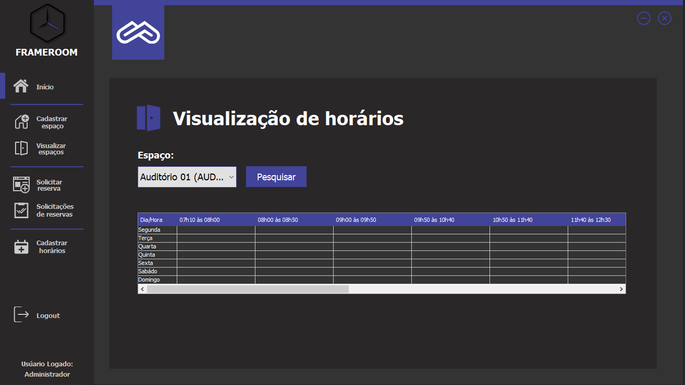

# Frameroom - Gestão de espaço

## 📝 Sobre

**Frameroom** é uma aplicação de gestão de espaço feita para o prédio CCET da Universidade Estadual de Montes Claros (Unimontes)

O software permite registro e login, cadastro/exclusão/edição de usuarios, espaços, reservas, solicitações de reserva, horarios. Além de um sistema de envio de e-mail.


---------

## 🖥️ Demonstração

<h1>
     
  
<h1>
     


----------


## 🚀 Tecnologias e ferramentas utilizadas

- **Java**
- **Swing**
- **SQL**
- **JavaMail**

---------

## 💻 Instalação e uso

```bash
# Abra um terminal e copie este repositório com o comando
$ git clone https://github.com/RodrigoFonsecaG/moveit.git
# ou use a opção de download.

# Entre na pasta do projeto 
$ cd moveit


-----------
